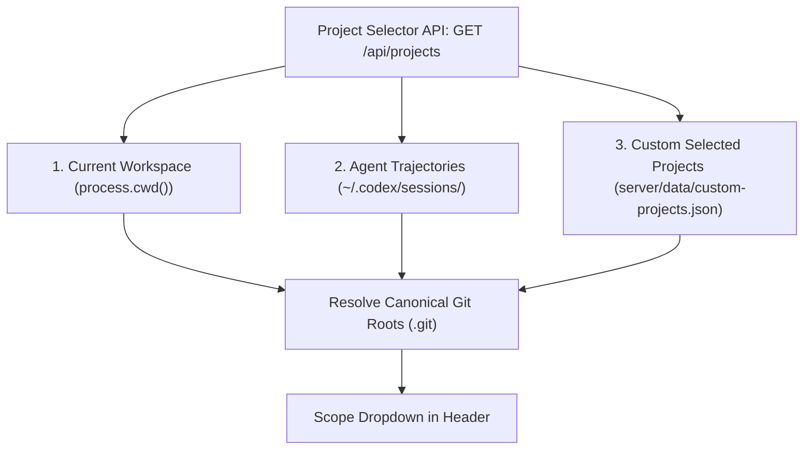

# ⚡ Agent Token Tracker & Optimization Advisor

An intelligent, 100% local developer platform and CLI utility built with **Vue 3 Composition API** and **Node.js** that tracks Codex token usage, monitors real-time 5-hour and weekly rate limits, detects context bloat and tool output noise, and executes 7 high-leverage optimization actions.

---

## 🚀 Quick Start

### 1. Launch the Vue 3 Web Dashboard
```bash
cd agent-token-tracker
npm start
```
Then open **[http://localhost:3333](http://localhost:3333)** in your browser.

### 2. Run the Terminal CLI Report
```bash
cd agent-token-tracker
node cli.js
```

---

## 🌟 Key Capabilities

1. **Real-Time Rate-Limit Meter**:
   - 5-Hour rolling window usage percentage with live countdown until reset.
   - Real-time token burn velocity (tokens/min) and exhaustion forecast.

2. **Guided Optimization Advisor (What-If Simulation)**:
   - Quantified waste calculation for every detected issue (e.g. *"Heavy test dumps cost 65,000 tokens — 26% of 5-hour quota"*).
   - Multi-option action selector with the **Recommended Fix** highlighted on top.
   - 1-Click direct file application to `AGENTS.md` and `package.json` with **Instant Undo/Rollback**.

3. **Session Explorer & Turn-by-Turn Inspector**:
   - Filter and search past threads with health scores (🟢 Lean, 🟡 Bloated, 🔴 Noisy).
   - Hoverable tooltips defining **`In:`** (Total Input Context), **`Cache:`** (Prompt Cached), **`Think:`** (Reasoning/Chain-of-thought), and **`Out:`** (Model Output).
   - **`📑 Generate docs/ Issues`**: Automatically scans the session and writes structured Markdown post-mortem issue reports into `docs/tokens-consumptions/issues/` for heavy/problematic turns (`>15k` fresh un-cached tokens, noise spikes, or `≥3` tool calls).

4. **Multi-Project Scope & File System Browser**:
   - Switch between repositories dynamically or view aggregate metrics across all projects.
   - Built-in **Directory Explorer (`📁+`)** allowing you to browse your local computer and add any codebase with automatic detection of Node.js, Python, Rust, Go, Git, and `AGENTS.md`.

5. **Pre-Flight Prompt Token Linter**:
   - Interactive scratchpad to test draft prompts for token expansion risks before sending to an agent.
   - Generates token-lean rewrites with estimated token savings.

6. **State-Preserving Session Handoff Compiler**:
   - Extracts task goals, modified files, and last decisions from bloated threads into a clean 1-paragraph prompt to resume in a fresh session saving ~85% input tokens.

7. **Educational Tooltip & Glossary System**:
   - Hoverable `ℹ️` tooltips on every metric, button, and action.
   - Slide-out **Agent Token Guide & Glossary** drawer explaining *Cached Input*, *Reasoning Tokens*, *5-Hour Limits*, *Payload Noise*, and *Progressive Disclosure*.

---

## 🔍 How Project Discovery Works

The tracker aggregates projects across **3 complementary mechanisms** without requiring manual configuration:



1. **Auto-Discovery from Agent Trajectories**:
   - The parser reads session logs from `~/.codex/sessions/`.
   - Each conversation records the directory the agent was working in (`session.meta.cwd`).
   - The tracker traverses up the path to the canonical Git root (`.git`), groups sessions by project, and displays session counts (e.g. `📁 my-project (14 sessions)`).
2. **Current Active Directory**:
   - The directory where the server is executed (`process.cwd()`) is automatically registered as the default workspace.
3. **Custom Local Projects (`📁+`)**:
   - Directories selected via the in-app Directory Browser or entered as absolute paths are saved to local persistent storage (`server/data/custom-projects.json`).

---

## 🔒 Data Sensitivity & Privacy by Design

- **100% Local Execution**: All log parsing, token diagnostics, file diffs, and benchmark calculations run entirely on your local machine. No session data, code, or prompts are sent to external cloud servers.
- **Git Ignore Safeguards**:
  - `server/data/` (custom project definitions and local preferences are kept out of source control).
  - `.backups/` (automatic pre-modification file snapshots are kept strictly local).
  - `docs/tokens-consumptions/issues/*.md` (generated post-mortems for private repos are ignored).
  - `*.jsonl`, `*.log`, `.env*` (raw conversation traces and secrets are protected).

---

## 🔌 Multi-Agent Extensibility Architecture

While Codex session logs are parsed out of the box, the system is designed around a modular **Agent Telemetry Adapter** pattern:

| Agent Runner | Telemetry Source | Supported Format |
| :--- | :--- | :--- |
| **Codex** | `~/.codex/sessions/rollout-*.jsonl` | Line-delimited JSON events |
| **Antigravity / Gemini CLI** | `~/.gemini/antigravity/brain/*/transcript.jsonl` | Step trajectories & tool calls |
| **Claude Code** | `~/.claude/projects/*/logs/*.jsonl` | Interaction JSONL |
| **In-Project Telemetry** | `<project>/.agents/logs/*.jsonl` | Universal OpenInference / JSON |

---

## 📚 Architecture & Reference Documentation

Detailed architectural deep dives and operational reference documents are organized in [`docs/architecture/`](docs/architecture/):

- **[🧠 Mental Model & Token Economics](docs/architecture/mental-model.md)**: Details the quadratic context accumulation trap, prompt cache physics, reasoning effort trade-offs, and progressive disclosure principles.
- **[🤖 Multi-Agent Architecture & Ingestion](docs/architecture/multi-agent-system.md)**: Explains the normalized session schema, parser adapter pattern, and real-time agent switcher (`All`, `Codex`, `Antigravity`).
- **[📁 Project Discovery & Data Privacy](docs/architecture/project-discovery-and-privacy.md)**: Covers the 3-layer discovery pipeline, local directory browsing, dynamic path resolution, and zero-egress data privacy safeguards.
- **[⚡ Optimization Actions & Diagnostics](docs/architecture/optimization-actions-and-diagnostics.md)**: Documents the 7 high-leverage optimization actions, turn efficiency diagnosis, and batch post-mortem generation (`docs/tokens-consumptions/issues/`).
