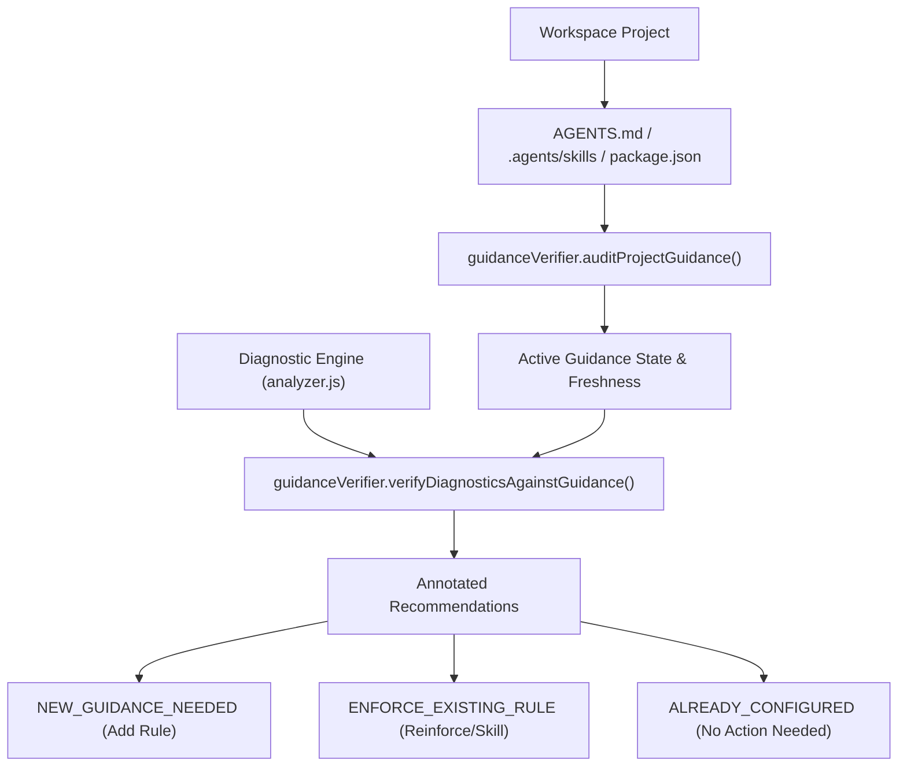

# Architecture Plan: Agent Guidance Verification Layer

This document establishes the technical blueprint, verification mechanics, data models, and implementation roadmap for verifying token optimization outputs and diagnostic recommendations against real, active, up-to-date **Agent Guidance** (`AGENTS.md`, `.agents/skills/`, and `package.json`).

---

## 1. Problem Statement & Motivation

As AI agent recommendations evolve, two failure modes can emerge:
1. **Redundant Proposal Drift**: The diagnostic engine proposes adding a rule to `AGENTS.md` or a script to `package.json` that *already exists* in the project repository.
2. **Guidance Violation vs Missing Guidance**: When an agent turn wastes tokens (e.g. running unbounded file reads or noisy test commands), the tracker must distinguish whether:
   - **Missing Guidance**: The project has never established this rule (action: propose injecting rule into `AGENTS.md`).
   - **Guidance Drift / Violation**: The project *already has* an active rule in `AGENTS.md` requiring progressive disclosure, but the agent ignored or violated it (action: flag rule compliance violation, reinforce prompt or encapsulate into an explicit skill).
3. **Monthly Review Cadence Enforcement**: `AGENTS.md` specifies a mandatory 30-day review checklist. The system needs an automated check to verify whether guidance is fresh or due for a refresh.

---

## 2. Core Architecture & Verification Engine

### Module: `server/guidanceVerifier.js`

### Key Functions & Interfaces

#### 1. `auditProjectGuidance(projectPath)`
Scans the project root to extract active constraints and evaluate freshness:
- **`activeRules`**:
  - `progressiveDisclosure`: whether `StartLine`/`EndLine` or slice rules are mandated.
  - `quietTestExecution`: whether `--bail 1` and `--silent` are mandated.
  - `lowReasoningDefaults`: whether low reasoning is default for routine chores.
  - `turnLimitHandoff`: whether session turn limits (15-20 turns) and handoffs are mandated.
- **`activeSkills`**: list of skills in `.agents/skills/` with their invocation modes (`allow_implicit_invocation`).
- **`packageScripts`**: checks presence of `"test:agent"` or quiet runner commands in `package.json`.
- **`syncFreshness`**:
  - `lastSyncDate`: timestamp of last recorded guidance review.
  - `isReviewDue`: `true` if `Date.now() - lastSyncDate > 30 days`.

#### 2. `verifyTurnCompliance(turn, activeGuidance)`
Audits an individual turn's tool execution against the active `AGENTS.md` rules:
- Checks if turn executed unbounded `view_file` while `progressiveDisclosure` rule is active $\rightarrow$ Flags `VIOLATION: UNBOUNDED_READ`.
- Checks if turn executed unfiltered test runner while `quietTestExecution` is active $\rightarrow$ Flags `VIOLATION: NOISY_TEST`.
- Checks if turn used high reasoning on routine task while `lowReasoningDefaults` is active $\rightarrow$ Flags `VIOLATION: HIGH_REASONING_ROUTINE`.

#### 3. `verifyDiagnosticsAgainstGuidance(diagnostics, projectPath)`
Annotates recommendations produced by `server/analyzer.js` with:
- `verificationStatus`: `'NEW_GUIDANCE_NEEDED'` | `'ENFORCE_EXISTING_RULE'` | `'ALREADY_CONFIGURED'`
- `existingRuleRef`: file path and matched section in `AGENTS.md` if rule already exists.

---

## 3. API Specification

| Endpoint | Method | Description |
| :--- | :--- | :--- |
| `/api/guidance/verify` | `GET` | Returns project guidance audit, active rule inventory, sync freshness, and turn compliance violations for the active scope. |
| `/api/guidance/sync-review` | `POST` | Logs completion of the monthly 30-day guidance review checklist in guidance records. |

---

## 4. UI Specification

### 1. Header Verification Indicator ([`src/components/dashboard/AppHeader.vue`](src/components/dashboard/AppHeader.vue))
- Adds **"🔍 Verify Agent Guidance"** button in top bar.
- Badges:
  - 🟢 **Guidance Up-to-Date** (All rules aligned, reviewed within 30 days)
  - 🟡 **Rule Drift Detected** (Agent turns violated active rules)
  - 🔴 **Monthly Review Due** (>30 days since last review)

### 2. Guidance Verification Modal ([`src/components/GuidanceVerificationModal.vue`](src/components/GuidanceVerificationModal.vue))
- Shows active rules, skill inventory, sync status, and turn compliance breakdown.
- One-click button: **"Mark 30-Day Review Complete"**.

---

## 5. Implementation Status & Next Steps

- [x] **Architecture Specification**: Complete (this document).
- [ ] **Phase 1 — Backend Engine**: Create `server/guidanceVerifier.js` and add unit tests (`tests/guidanceVerifier.test.js`).
- [ ] **Phase 2 — Ingestion & API**: Wire into `server/analyzer.js` and expose `/api/guidance/verify`.
- [ ] **Phase 3 — UI & Interaction**: Build `GuidanceVerificationModal.vue` and wire into `AppHeader.vue` and `App.vue`.
