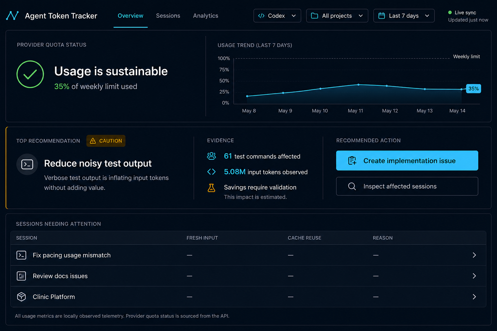

# Home dashboard redesign implementation brief

Status: design and implementation handoff; no production UI changes are included
in this document.

Audience: an implementation agent working with limited reasoning context.

Related source of truth:

- [Frontend usability model](./frontend-usability.md)
- [Recommended desktop visual](./assets/agent-token-tracker-home-redesign.png)

## 1. Objective

Redesign the home screen so a developer can answer these questions, in order,
without interpreting a wall of telemetry:

1. Is provider usage currently safe?
2. What is the most important observed inefficiency in the selected scope?
3. What evidence supports that diagnosis?
4. What should the developer do next?
5. Which sessions should the developer inspect?

The intended product statement is:

> Agent Token Tracker helps developers identify which agent sessions waste
> tokens, understand why, and choose one evidence-backed improvement.

The home screen is a read-only decision aid. It is not an all-features control
panel, a billing dashboard, or a replacement for the full session explorer.

## 2. Visual target



Treat the image as the target for hierarchy, density, visual grouping, and
desktop composition. Text, controls, numbers, charts, and table rows must remain
real Vue-rendered UI driven by application state. Do not use the image as a
background or ship it as the interface.

The concept intentionally preserves the current dark developer-tool character:

- near-black navy page background;
- slightly lighter navy surfaces;
- thin cool-gray dividers and borders;
- white primary text and muted slate secondary text;
- cyan for selection and measured telemetry;
- green only for sustainable provider status;
- amber only for caution or validation-required information;
- restrained monospace for numeric values only.

The screenshot contains placeholder dashes in some session cells. Production
code must display real values from each session.

## 3. Current problems to solve

### 3.1 Competing product purposes

The current header exposes Issues, Guidance Log, Live Benchmark, Prompt Linter,
Guide & Glossary, and Live Sync with similar prominence. The body then presents
quota pacing, lifetime metrics, token composition, daily burn, recommendations,
and every session in one continuous page.

Result: the user sees many capabilities but no clear primary task.

### 3.2 Conflicting scopes

The project selector filters the overall data. The metrics area owns a separate
time filter. The recommendation area owns another all-time/5-hour/week filter,
date picker, and optional thread filter.

Observed failure: selecting `Today` changed the metric totals but left the
recommendation summary on `All Recorded History`. Two nearby sections therefore
described different populations without a strong warning.

### 3.3 Telemetry precedes the decision

The user must pass several aggregate metrics and charts before reaching the
recommendation. Lifetime token totals are visually dominant even though they do
not explain what action to take.

### 3.4 Evidence types look equally authoritative

Provider quota, locally observed transcript tokens, derived cache ratios,
estimated dollar savings, and unvalidated savings forecasts appear in similar
cards and typography. The user must read supporting prose to discover which
values are measured and which are estimates.

### 3.5 Excessive page length

The current all-project view renders the full session table beneath all other
sections. The inspected page was approximately 11,000 CSS pixels tall for 122
sessions. The home screen should summarize and route to detail, not render all
detail by default.

### 3.6 Horizontal overflow

The inspected page measured:

- desktop: `1280px` viewport and approximately `1343px` document width;
- mobile: `390px` viewport and approximately `679px` document width.

The mobile header clipped controls and the first viewport showed navigation and
loading rather than useful status. This is a functional responsive defect.

## 4. Information architecture

Use three top-level views. A full router is optional for the first slice; local
view state is acceptable if it preserves browser behavior already expected by
the project.

### Overview

The redesigned home screen described by this document. It contains only:

1. global scope controls;
2. provider quota health and a compact trend;
3. the highest-impact recommendation for the current scope;
4. up to three sessions needing attention;
5. links into detailed views.

### Sessions

Owns the complete searchable and filterable session table and the existing turn
inspector workflow.

### Analytics

Owns aggregate metric cards, token composition, daily burn timeline, and longer
historical exploration.

### Tools menu

Move these existing secondary utilities out of the primary header and into one
`Tools` menu or similarly compact secondary surface:

- generated issues;
- guidance log;
- live benchmark;
- prompt linter;
- guide and glossary.

Do not remove their existing behavior or modals in the first redesign slice.

## 5. Global scope contract

Create one scope model used by Overview, Sessions, and Analytics.

```js
const dashboardScope = reactive({
  agent: 'codex',       // 'codex' | 'antigravity'
  workspace: 'all',     // 'all' or a discovered project path
  timeRange: '7d',      // '5h' | 'today' | '24h' | '7d' | '30d' | 'all'
  sessionId: null       // optional detail-only refinement
});
```

The exact implementation may use individual refs, but every visible section
must derive from the same values.

Rules:

1. The header shows the active agent, project, and time range at all times.
2. A scope change updates quota context, locally observed metrics,
   recommendations, trend data, and session results together.
3. If provider quota is account-level and cannot be project-filtered, keep it
   visually separate and label it `Provider quota status`.
4. Never imply that local observed tokens convert directly to provider quota.
5. Recommendation API calls receive the same workspace, agent, and time-range
   meaning as the rest of the screen.
6. If an API cannot honor part of the selected scope, display that limitation
   explicitly instead of silently falling back to all history.
7. Preserve the current saved agent and workspace behavior. Add saved time range
   only if doing so does not introduce stale or surprising defaults.

## 6. Overview screen specification

### 6.1 Quiet application header

Desktop order:

1. brand: `Agent Token Tracker`;
2. navigation: `Overview`, `Sessions`, `Analytics`;
3. scope controls: agent, project, time range;
4. small `Live sync` status;
5. compact `Tools` menu.

Requirements:

- only the active navigation item receives the cyan selected treatment;
- Live Sync is a status/control, not the largest header action;
- use text labels and restrained line icons rather than emoji-heavy buttons;
- the project label truncates safely without widening the page;
- all controls have visible keyboard focus states.

### 6.2 Provider quota health band

Purpose: answer `Is it safe to continue using the agent?`

Left side:

- label: `Provider quota status`;
- status headline derived from pacing status;
- the most decision-relevant provider percentage;
- reset timing or data freshness when available;
- unavailable and stale states when applicable.

Right side:

- compact trend for the provider window when real snapshots exist;
- otherwise use a truthful alternative such as the two current provider meters;
- do not manufacture historical provider points from local transcript totals.

Status copy mapping:

| API status | Headline | Semantic color |
| --- | --- | --- |
| sustainable/default | `Usage is sustainable` | green |
| warning | `Usage is approaching the limit` | amber |
| critical | `Usage is at high risk` | red |
| unavailable | `Provider quota is unavailable` | muted slate |

Provider quota must remain visually distinct from observed local telemetry.

### 6.3 Top recommendation panel

Purpose: answer `What should I change next, and why?`

Show exactly one recommendation by default: the highest-impact applicable
diagnostic for the current scope. Do not render all diagnostic tabs on the home
screen.

Panel anatomy:

1. `Top recommendation` label and severity;
2. concise finding title;
3. one-sentence explanation;
4. measured evidence list;
5. estimation/validation disclosure;
6. one primary next action;
7. one secondary inspection action.

Evidence labels must identify their epistemic status:

- `Measured`: directly counted from parsed telemetry;
- `Derived`: calculated from measured fields, such as cache ratio;
- `Estimated`: based on an explicit pricing or savings model;
- `Requires validation`: a proposed benefit without matched before/after data.

For the currently observed noisy-test recommendation, suitable copy is:

- title: `Reduce noisy test output`;
- explanation: `Test commands without focused output flags can carry unnecessary
  console text into subsequent context.`;
- measured evidence: number of affected commands and input context observed in
  affected turns;
- limitation: `Telemetry does not isolate console output from the rest of the
  turn, so token savings require a comparable before/after run.`;
- primary action: `Create implementation issue`;
- secondary action: `Inspect affected sessions`.

Do not say verbose output definitively caused all affected input tokens. Do not
present unvalidated savings as money saved.

### 6.4 Sessions needing attention

Show a maximum of three rows on Overview, ranked by diagnostic severity and
then by relevant measured impact. Do not show lean sessions merely to fill the
list.

Columns:

- session name;
- fresh input;
- cache reuse;
- primary reason;
- inspect action.

Use real values:

```js
freshInput = Math.max(inputTokens - cachedInputTokens, 0);
cacheReuse = inputTokens > 0
  ? Math.round((cachedInputTokens / inputTokens) * 100)
  : 0;
```

Selecting a row opens the existing `TurnInspectorModal` or navigates to the
Sessions view with that session selected. The full list belongs in Sessions.

### 6.5 Supporting analytics

The first Overview slice may include only one compact trend. Move the following
existing content to Analytics without deleting its calculations:

- lifetime total tokens;
- cache hit rate card;
- reasoning tokens card;
- estimated cache savings card;
- token composition breakdown;
- daily token burn timeline.

## 7. Component ownership

Prefer small focused components. Suggested structure:

```text
src/
  components/
    dashboard/
      AppHeader.vue
      ScopeControls.vue
      ProviderQuotaSummary.vue
      UsageTrend.vue
      TopRecommendation.vue
      EvidenceList.vue
      AttentionSessionList.vue
      ToolsMenu.vue
    views/
      OverviewView.vue
      SessionsView.vue
      AnalyticsView.vue
```

This structure is a recommendation, not a requirement to rename everything in
one commit. Safe incremental mapping:

| Existing owner | First redesign responsibility |
| --- | --- |
| `HeaderNav.vue` | simplify header and add primary view selection |
| `RateLimitMeter.vue` | supply/reuse provider quota presentation logic |
| `GuidedOptimizer.vue` | expose one top recommendation and evidence |
| `SessionList.vue` | remain full Sessions view; extract three-row summary |
| `MetricsOverview.vue` | move to Analytics |
| `TokenBurnChart.vue` | move to Analytics or provide compact trend |
| `App.vue` | compose views and own shared scope; avoid diagnostic logic |

Do not duplicate health thresholds in multiple components. Extract shared
helpers only when two real consumers exist.

## 8. Data and behavior requirements

### Preserve

- project discovery from recorded sessions;
- Codex/Antigravity switching;
- local storage for current agent and workspace;
- automatic refresh behavior;
- current issue-generation endpoints and modals;
- turn inspection;
- guidance history and rollback behavior;
- provider pacing from the server API as the single pacing implementation.

### Correct

- `App.vue` currently receives `filteredPacingForecast` but passes
  `pacingForecast` into the rate-limit component. Use the intentionally scoped
  source and document whether provider data is account-level.
- remove or stop exporting unused project mutation helpers if they conflict with
  the established discovered-project model; do not reintroduce add-project UI.
- recommendations and metric summaries must not silently use different time
  populations.

### Do not add

- new backend pricing assumptions;
- fabricated quota history;
- editable recommendation text;
- automatic mutation of `AGENTS.md` or `package.json` from the Overview screen;
- another state-management library;
- a new chart library unless existing CSS/SVG rendering cannot meet the compact
  trend requirement;
- pagination, routing, or abstractions beyond what the accepted slice needs.

## 9. Responsive behavior

### Desktop: 1200px and wider

- single header row where space permits;
- provider status and trend use a roughly 40/60 split;
- recommendation panel uses three readable regions: finding, evidence, action;
- session summary uses a table/list layout;
- page width never exceeds the viewport.

### Tablet: 768px to 1199px

- header may use two rows: brand/navigation, then scope controls;
- provider status stacks above trend when necessary;
- recommendation finding spans full width with evidence and actions below;
- avoid shrinking body or control text below readable sizes.

### Mobile: below 768px

- brand, active view, and a single scope/menu control appear first;
- scope controls open in a compact disclosure panel or stack vertically;
- provider status is visible in the first viewport after the header;
- trend follows the status and may simplify labels;
- recommendation regions stack in reading order;
- action buttons use full available width;
- session summary becomes stacked rows with labels rather than a forced wide
  table;
- the full Sessions table may retain its own internal horizontal scroll as
  allowed by the frontend usability model;
- `document.documentElement.scrollWidth <= window.innerWidth` on Overview.

Use `min-width: 0` on flex/grid children, constrain select widths, and avoid
fixed minimum widths on top-level containers. Do not hide overflow globally to
mask layout defects.

## 10. Accessibility and content rules

- Use semantic `header`, `nav`, `main`, `section`, headings, buttons, and table
  markup.
- Provide programmatic labels for icon-only controls.
- Selected navigation and status must not rely on color alone.
- Preserve visible focus indicators.
- Meet WCAG AA contrast for normal text and controls.
- Announce live refresh failures or stale data without repeatedly interrupting
  screen-reader users.
- Use `aria-current="page"` for the active view.
- Use `aria-pressed` for toggle-style controls where appropriate.
- Use sentence case for headings and buttons.
- Prefer `Provider quota`, `Observed tokens`, `Fresh input`, `Cached input`,
  `Reasoning`, and `Output` consistently.
- Never call cached tokens free.
- Never label transcript totals as provider usage.

## 11. Loading, empty, error, and stale states

Implement each state explicitly.

### Initial loading

Render the app shell and stable skeleton regions. Do not replace the entire page
with a centered spinner that leaves the first viewport empty.

### Refreshing

Keep existing data visible and show a small refreshing indicator near Live Sync.

### Empty scope

Copy: `No recorded sessions match this scope.` Provide a clear way to change the
project or time range.

### No diagnostic

Copy: `No meaningful inefficiency was detected in this scope.` Link to Sessions
or Analytics rather than showing an empty recommendation frame.

### Provider unavailable

Keep local telemetry available. Label provider status as unavailable and avoid a
green sustainable fallback.

### Stale data

Show the last successful update time and keep provider/local sources clearly
identified.

### Request failure

Show a concise inline error and retry action for the affected region. Do not
discard unrelated successful data.

## 12. Design tokens

Start from existing variables in `src/styles/main.css`. The following values are
the visual target, but reuse an existing equivalent rather than creating a
duplicate token:

```css
:root {
  --dashboard-bg: #07101d;
  --dashboard-surface: #0b1626;
  --dashboard-surface-raised: #101d30;
  --dashboard-border: #2a3a50;
  --dashboard-text: #f8fafc;
  --dashboard-text-muted: #9aa8bb;
  --dashboard-cyan: #2dcaf5;
  --dashboard-green: #60e56f;
  --dashboard-amber: #f5b301;
  --dashboard-red: #fb7185;
  --dashboard-radius: 10px;
  --dashboard-focus: 0 0 0 3px rgba(45, 202, 245, 0.32);
}
```

Spacing should follow a restrained 4/8px rhythm. Use fewer framed containers
than the current UI. Prefer dividers and open sections over nested cards.

## 13. Implementation sequence

Work one slice at a time. Do not batch later slices merely because an earlier
slice is complete.

### Slice 1: shared scope and shell

1. Introduce the primary view state and global scope contract.
2. Simplify the header.
3. Keep existing utility modals reachable through Tools.
4. Verify scope controls continue to refresh the existing data.

Acceptance: the shell has no horizontal overflow at desktop or mobile widths,
and no existing utility becomes unreachable.

### Slice 2: Overview decision path

1. Add provider quota summary.
2. Present one highest-impact recommendation.
3. Add measured/derived/estimated labels.
4. Add the three-row attention session summary.
5. Reuse existing inspection and issue-generation actions.

Acceptance: a new user can identify status, finding, evidence, next action, and
affected sessions from the first desktop viewport.

### Slice 3: move detail into views

1. Move the full session explorer to Sessions.
2. Move aggregate cards and token charts to Analytics.
3. Preserve existing calculations and filters until their shared-scope
   replacement is verified.

Acceptance: Overview is concise and detailed capabilities remain available.

### Slice 4: responsive and state completion

1. Complete tablet and mobile layouts.
2. Replace full-page loading spinner with shell skeletons.
3. Add empty, unavailable, stale, and regional error states.
4. Verify keyboard navigation and visible focus.

## 14. Acceptance criteria

### Product clarity

- [ ] The first meaningful heading communicates provider usage health.
- [ ] Exactly one top recommendation is visually dominant on Overview.
- [ ] The recommendation shows evidence and limitations before the action.
- [ ] The primary action uses an explicit verb and destination.
- [ ] The full session table is not rendered on Overview.
- [ ] Secondary tools do not compete with the primary workflow in the header.

### Scope consistency

- [ ] Agent, project, and time range are visible in one location.
- [ ] Metrics, diagnostics, trends, and sessions use the same selected scope.
- [ ] Any unavoidable scope mismatch is explicitly labeled.
- [ ] Provider quota is not described as local token consumption.

### Responsive behavior

- [ ] No document-level horizontal overflow at 1280px.
- [ ] No document-level horizontal overflow at 390px on Overview.
- [ ] Provider status appears before analytics on mobile.
- [ ] Primary actions are fully visible and usable on mobile.
- [ ] The full session table scrolls only inside its owned container when needed.

### Data integrity

- [ ] Measured, derived, estimated, and validation-required values are labeled.
- [ ] No savings claim is inferred from noisy-test correlation alone.
- [ ] No provider trend is fabricated from transcript totals.
- [ ] Empty and unavailable values do not silently render as zero or sustainable.

### Regression safety

- [ ] Agent and project selection still work.
- [ ] Live refresh still works and does not blank existing data.
- [ ] Issue generation still works.
- [ ] Session inspection still works.
- [ ] Guidance records, benchmark, prompt linter, and glossary remain reachable.
- [ ] Existing provider pacing remains server-owned.

## 15. Verification plan

Use the project’s focused verification workflow and suppress noisy passing output.

1. Run the focused tests available for the touched components/composables with
   bail and silent behavior.
2. Run `pnpm build` or the installed Vite binary if the package runner performs
   an unrelated network check.
3. Open the application in the in-app browser.
4. Verify page identity, meaningful content, no framework overlay, and console
   health.
5. Test the core path:
   `Overview -> change time range -> recommendation and sessions update ->
   inspect affected session`.
6. Test the secondary path:
   `Overview -> create implementation issue -> issue state becomes visible`.
7. Test desktop at 1280px or wider and mobile at 390x844.
8. Record `window.innerWidth` and `document.documentElement.scrollWidth` for
   both viewports.
9. Compare the final first viewport with the supplied visual target for:
   hierarchy, copy, container model, palette, spacing, control density, and
   responsive behavior.
10. Inspect loading, empty, provider-unavailable, stale, and error states with
    controlled fixtures or mocked responses.

## 16. Explicit non-goals

This redesign does not authorize:

- changing parser accounting;
- changing diagnostic thresholds without separate evidence;
- changing provider pacing calculations;
- adding authentication or cloud synchronization;
- deleting existing tools or historical views;
- automatically applying recommendations;
- writing to other repositories;
- introducing a general-purpose design system rewrite;
- replacing Vue or Vite;
- implementing later slices before the current slice is reviewed.

## 17. Handoff prompt for a lower-reasoning implementation model

Use the following prompt with this file attached or referenced:

> Implement only Slice 1 from
> `docs/architecture/home-dashboard-redesign-implementation-brief.md`.
> Treat that file and `docs/architecture/frontend-usability.md` as the product
> contract. Preserve all existing functionality and the untracked
> `.agents/guidance-history.json` file. Inspect only the named components and
> their direct dependencies. Do not implement Slice 2 or later. Before editing,
> summarize the files you will touch and why. After editing, run focused silent
> validation, then verify desktop and 390x844 mobile rendering with the browser.
> Report any acceptance criterion that remains unverified. Do not commit.

After Slice 1 is reviewed, change only `Slice 1` to `Slice 2`, and repeat. Do not
send the whole redesign as a single implementation request.
