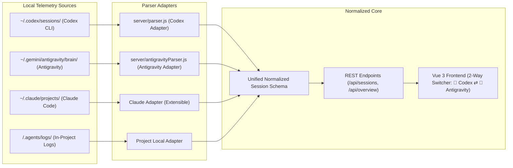

# 🤖 Multi-Agent Architecture & Ingestion Pipeline

The **Agent Token Tracker** is built around an extensible **Agent Telemetry Adapter** pattern that normalizes disparate conversation trajectory formats into a single unified analytical schema.

---

## 1. Supported Agent Platforms



---

## 2. Ingestion Details by Agent Runner

### 🤖 1. OpenAI Codex
- **Storage Location**: `~/.codex/sessions/rollout-*.jsonl` and `~/.codex/session_index.jsonl`.
- **Parser**: [`server/parser.js`](file:///home/ellol/apps/agent-token-tracker/server/parser.js)
- **Ingestion Mechanics**:
  - Reads line-delimited JSON events (`session_meta`, `turn_context`, `token_usage`, `rate_limits`).
  - Correlates session IDs with human-readable thread names from `session_index.jsonl`.
  - Captures exact provider-reported token usage and rate-limit headers.

### 🌌 2. Google Antigravity / Gemini CLI
- **Storage Location**: `~/.gemini/antigravity/brain/<conversation-id>/.system_generated/logs/transcript.jsonl`
- **Parser**: [`server/antigravityParser.js`](file:///home/ellol/apps/agent-token-tracker/server/antigravityParser.js)
- **Ingestion Mechanics**:
  - Extracts user goals from `<USER_REQUEST>` blocks and system checkpoints.
  - Groups steps chronologically into discrete interaction turns based on `USER_INPUT` markers.
  - Identifies active models (e.g. `Gemini 3.7 Flash`, `Gemini 3.6 Flash (High)`).
  - Traverses tool invocations (`find_by_name`, `view_file`, `replace_file_content`, `run_command`) and computes input, cache, thinking, and output tokens.

---

## 3. Normalized Universal Session Schema

Every agent parser outputs sessions conforming to this standardized contract:

```typescript
interface NormalizedSession {
  sessionId: string;
  threadName: string;
  updatedAt: string;
  createdAt: string;
  filePath: string;
  turnCount: number;
  agentType: 'codex' | 'antigravity' | 'claude_code' | 'custom';
  agentIcon: string;
  agentLabel: string;
  meta: {
    id: string;
    sessionId: string;
    cwd: string;
    model: string;
    agentType: string;
    reasoningEffort: 'low' | 'medium' | 'high' | 'default';
    timestamp: string;
  };
  totalUsage: {
    input_tokens: number;
    cached_input_tokens: number;
    reasoning_output_tokens: number;
    output_tokens: number;
    total_tokens: number;
  };
  turns: Array<{
    turnNumber: number;
    startedAt: string;
    userPrompt: string;
    assistantMessage: string;
    toolCalls: Array<{ tool: string; input: any }>; // Range metadata in input distinguishes bounded from unbounded file reads.
    noiseSpikes: Array<{ type: string; message: string }>;
    durationMs: number;
    tokenUsage: TokenUsage;
  }>;
}
```

Session totals are the sum of the displayed turn-level token measurements. This keeps the session card, charts, and turn timeline reconcilable; a cumulative parser snapshot is used only when no turn-level measurement is available.

---

## 4. Direct 2-Way Agent Switcher (UI)

In [`HeaderNav.vue`](file:///home/ellol/apps/agent-token-tracker/src/components/HeaderNav.vue), users flip between the two active agent runners with a dedicated 2-way toggle:
- **`🤖 Codex`**: Isolates token metrics, rate limits, turn inspections, and recommendations strictly to OpenAI Codex sessions.
- **`🌌 Antigravity`**: Isolates token metrics, reasoning burn, tool calls, and turn footprints strictly to Google Antigravity sessions.

All dashboard cards, overview totals, and session lists dynamically re-compute to reflect the chosen agent immediately without an intermediate or mixed state.
