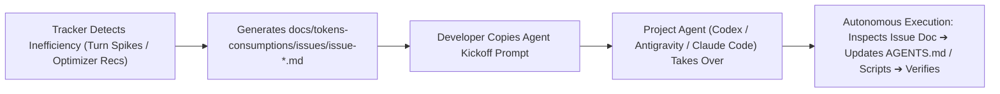

# ⚡ Optimization Actions & Diagnostic Engine

The diagnostic engine ([`server/analyzer.js`](file:///home/ellol/apps/agent-token-tracker/server/analyzer.js)) and action applier ([`server/actionApplier.js`](file:///home/ellol/apps/agent-token-tracker/server/actionApplier.js)) analyze agent trajectories to identify systemic inefficiencies and provide 1-click corrective remedies.

---

## 1. The 7 High-Leverage Optimization Actions

| Action # | Name | Target File | Impact |
| :---: | :--- | :--- | :--- |
| **Action 1** | **AGENTS.md Rule Injection** | `AGENTS.md` | Injects progressive disclosure rules, low reasoning defaults, and turn boundaries. |
| **Action 2** | **Package Quiet Script** | `package.json` | Adds `"test:agent": "... --bail=1 --silent"` to suppress noisy green assertion output. |
| **Action 3** | **Project Skill Generator** | `.agents/skills/<name>/SKILL.md` | Encapsulates complex repetitive multi-turn verification workflows into a single tool invocation. |
| **Action 4** | **State-Preserving Session Handoff** | UI Handoff Modal | Compiles thread goals, modified files, and decisions into a 1-turn prompt saving ~85% input context. |
| **Action 5** | **Pre-Flight Prompt Linter** | UI Prompt Linter | Identifies token expansion anti-patterns before sending prompts to the agent. |
| **Action 6** | **Atomic Undo / Rollback** | `.backups/` | Reverts any automated rule or script change with 1-click safety. |
| **Action 7** | **Pacing & Burn Rate Forecast** | UI Rate Limit Meter | Forecasts rolling 5-hour quota exhaustion and recommends pacing pauses. |

---

## 2. The `docs/` Issue Handoff Mechanism (Agent Work Orders)

Instead of manually editing files or re-prompting from scratch, the **Agent Token Tracker** adopts a dedicated **`docs/` Issue Handoff Pattern**:

### A. Structure of an Agent Work Order (`issue-*.md`)
Every generated markdown file contains:
1. **🤖 Kickoff Prompt**: A ready-to-use prompt linking `@docs/tokens-consumptions/issues/issue-*.md` with explicit task boundaries.
2. **📊 Telemetry Snapshot**: Exact numbers for `In`, `Cache`, `Think`, `Out`, duration, and tool count.
3. **🚨 Root Cause & Anti-Pattern Analysis**: Explains the exact mechanism of waste (unconstrained reads, verbose test dumps).
4. **🛠️ Step-by-Step Resolution Plan**: Precise file targets (`AGENTS.md`, `package.json`), rule text snippets, and silent test commands.
5. **❌ / ✅ Bad vs. Good Code Examples**: Concrete syntax examples for progressive disclosure.

---

## 3. Issue Generation Points Across the App

1. **Turn Inspector Header (`📑 Generate docs/ Issues`)**:
   - Scans the active thread and generates issue work orders for all heavy/spiky turns in one batch.
2. **Turn Inspector Individual Turns (`📑 Generate Issue`)**:
   - Creates a dedicated work order for a single selected interaction turn.
3. **Guided Optimization Recommendations (`📑 Generate Agent Issue Doc`)**:
   - Converts any recommendation (Action 1–3) into an issue work order ready for agent takeover.
4. **Header Issue Manager (`📋 Issues (docs/)`)**:
   - Displays all active issue work orders in the project.
   - Provides 1-click **"Copy Agent Handoff Prompt"**, markdown preview, and issue cleanup.

---

## 4. Interactive Same-Day 5-Hour Time Slice Filtering

The diagnostic engine supports granular same-day time filtering to pinpoint token consumption during specific working blocks:
- **Preset Windows**: Fast toggling between `Latest 5 Hours`, `00:00–05:00`, `05:00–10:00`, `08:00–13:00`, `10:00–15:00`, `12:00–17:00`, `14:00–19:00`, `17:00–22:00`, and `19:00–24:00`.
- **Start Hour Range Slider**: Drag the slider (`0:00` to `19:00`) to dynamically slice timestamps across `[YYYY-MM-DDTstartHour:00:00, YYYY-MM-DDT(startHour+5):00:00]` and immediately view localized waste diagnostics.

---

## 5. Guidance Log History Correlation & Status Flags

The analyzer automatically checks the active repository's Guidance History Log (`guidance-history.json`):
- **`📜 Added from Guidance Log`**: Displayed on diagnostic banner headers and tab buttons when a rule or script in that diagnostic was previously applied and recorded in project history.
- **`📜 Logged in History`**: Displayed on individual action cards next to `✅ Rule Active in Project`, with a hover tooltip displaying the log record's author, description, and date.
