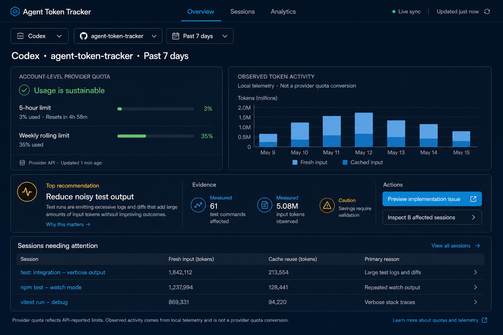
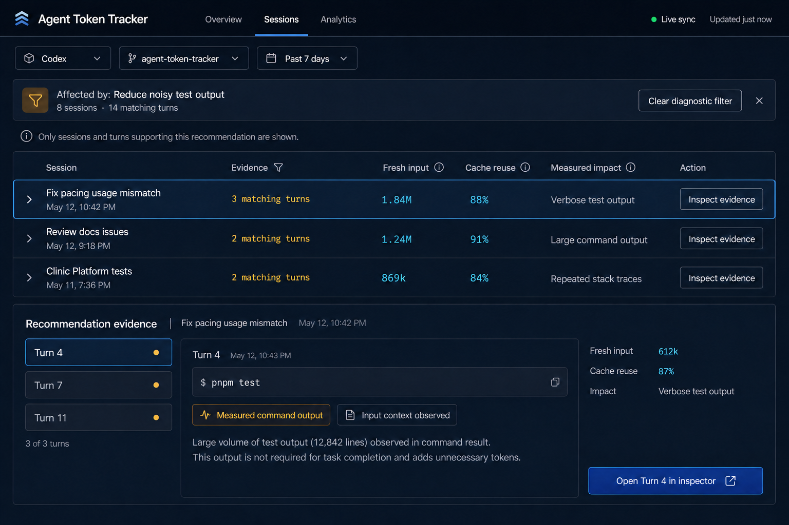
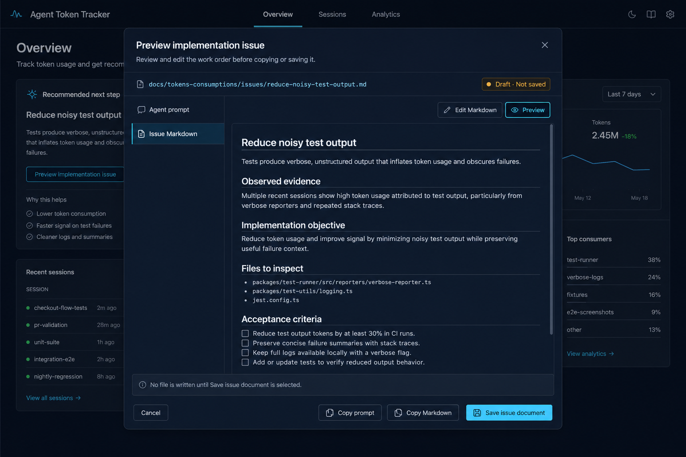

# Post-implementation dashboard improvements

Status: implementation-ready follow-up plan

Audience: a lower-reasoning implementation model working one reviewed task at
a time

Related references:

- [Frontend usability model](./frontend-usability.md)
- [Original home dashboard redesign brief](./home-dashboard-redesign-implementation-brief.md)
- Initial redesign implementation: commit `6c0ee83`

This file is the canonical plan for improvements discovered after the first
dashboard redesign was implemented. It does not authorize a redesign of the
completed shell or implementation of multiple tasks in one change.

## 1. Product objective

Improve the implemented dashboard so every visible claim is traceable to real
data and every primary action leads to a useful workflow.

The follow-up work must answer these questions:

1. Do all Overview sections represent the same selected scope?
2. Is Provider Quota showing provider-owned values without fabricated defaults?
3. Does Usage Trend plot real telemetry with truthful units?
4. Does Overview handle loading, empty, stale, and failed states usefully?
5. Does Inspection open the sessions and turns that produced the recommendation?
6. Can the user inspect and edit an issue before copying or saving it?

## 2. Visual references

These screenshots define hierarchy, workflow, and visible states. They are not
production assets and must never be used as page backgrounds. All controls,
text, charts, tables, and modal content remain code-native Vue UI.

Names, dates, counts, chart values, and generated Markdown shown in the images
are illustrative. Production UI must use real scoped telemetry and real
generator output. Where a screenshot label conflicts with this written plan,
the written data and behavior contract wins.

### 2.1 Corrected Overview



Key requirements shown:

- global agent, project, and time filters remain visible;
- account-level provider quota is labeled separately;
- five-hour and weekly provider windows are shown independently;
- the activity chart is explicitly local observed telemetry;
- chart units are tokens, not provider percentages;
- recommendation evidence distinguishes measured values from caution;
- actions say `Preview implementation issue` and
  `Inspect affected sessions`;
- only sessions needing attention appear on Overview.

### 2.2 Evidence-focused Inspection



Key requirements shown:

- Sessions is filtered by the selected recommendation;
- the banner names the diagnostic and affected counts;
- every row explains why it matched;
- relevant turns are visible and selectable;
- measured evidence is distinct from interpretation;
- the primary action opens the selected affected turn in the existing inspector;
- the diagnostic filter can be cleared without losing global scope.

### 2.3 Issue preview before save or copy



Key requirements shown:

- the proposed destination is visible;
- status says `Draft · Not saved`;
- prompt and Markdown are independently inspectable;
- Markdown can be edited or previewed;
- Copy Prompt and Copy Markdown do not require saving;
- only Save Issue Document writes a file;
- Cancel exits without a filesystem change.

The example files listed inside the pictured Markdown are not approved project
targets. The real preview must list files derived from the selected diagnostic
and repository inspection.

## 3. Required implementation order

Implement and review exactly one task at a time:

1. Task A — verify Overview filters and scope propagation;
2. Task B — fix Provider Quota truthfulness;
3. Task C — replace Usage Trend with real observed telemetry;
4. Task D — make Overview states and summaries useful;
5. Task E — make Inspection evidence-focused;
6. Task F — preview implementation issues before save or copy.

This dependency order matters. Inspection and issue generation must not be
built on mismatched filters, fabricated quota values, or an invented trend.

## 4. Task A — check filters on Overview

### Goal

Make agent, project, and time range one shared evidence boundary for all local
telemetry, diagnostics, attention sessions, and issue drafts.

Provider quota may remain account-level when that is the provider’s real scope,
but the UI must say so.

### Current risks

- `setTimeRange()` fetches diagnostics while sessions are filtered locally.
- `/api/overview` and `/api/sessions` are fetched without query scope, while
  diagnostics are server-filtered.
- session timestamps use `updatedAt || meta.timestamp`; server diagnostics may
  use different timestamp or timezone semantics.
- Today uses browser-local midnight; server filtering may use UTC.
- rapid changes can allow an older diagnostic response to replace a newer scope.
- `filteredPacingForecast` is an alias even though Provider Quota is usually
  account-level.

### Scope contract

| Surface | Agent | Project | Time range | Limitation |
| --- | --- | --- | --- | --- |
| Provider quota | yes | usually no | provider-owned window | label account-level scope |
| Recommendation | yes | yes | yes | save requires one project |
| Attention sessions | yes | yes | yes | show affected sessions only |
| Observed activity | yes | yes | yes | local telemetry only |
| Issue draft/save | yes | exactly one project | inherits diagnostic | no All Projects write |

### Required work

1. Define one canonical session timestamp helper.
2. Define one time-range boundary helper shared by local filtering and server
   request construction where practical.
3. Document Today as local time or UTC, then make both sides match.
4. Make every diagnostic response identify the scope it represents.
5. Ignore or cancel stale responses after a newer filter selection.
6. Keep previous data visible during refresh but mark it refreshing or stale.
7. Disable issue drafting for All Projects with an explanation.
8. Label Provider Quota when project/time filters do not apply.

### Verification matrix

For Codex and Antigravity, test:

- All Projects and one real project;
- 5 hours, Today, Past 24 hours, Past 7 days, Past 30 days, All time;
- a scope with sessions and a scope without sessions;
- provider quota available and unavailable.

For representative combinations compare:

1. visible scope;
2. filtered session count;
3. recommendation evidence count;
4. attention-session membership;
5. activity bucket totals;
6. issue destination eligibility;
7. provider quota source label.

### Acceptance criteria

- [ ] No section remains silently on the previous scope.
- [ ] Overview and Sessions counts agree for the same scope.
- [ ] Exact cutoff and Today boundaries are tested.
- [ ] All Projects cannot write a project issue.
- [ ] Provider quota states when project/time filters do not apply.
- [ ] Late responses from older scopes cannot overwrite current data.

## 5. Task B — fix Provider Quota status

### Confirmed defects

`ProviderQuotaSummary.vue` currently:

- falls back to literal `35%` values;
- can label a primary five-hour value as weekly;
- recomputes status thresholds in the client;
- can interpret synthetic zero-valued rate limits as sustainable data;
- does not clearly identify account-level provider scope.

### Required behavior

1. Keep the server pacing forecast as the single provider-status authority.
2. Remove every hardcoded percentage fallback.
3. Render exact provider windows independently:
   - `5-hour limit`;
   - `Weekly rolling limit`.
4. Use server status and advice instead of deriving a conflicting client status.
5. Missing quota renders `Provider quota is unavailable`.
6. Missing values never become zero or sustainable.
7. Show provider source and freshness when available.
8. Label quota `Account-level provider quota` when project filters do not apply.
9. Do not represent Antigravity local activity as provider quota without a real
   provider quota source.

Preferred view model:

```js
{
  available: true,
  status: 'SUSTAINABLE',
  headline: 'Usage is sustainable',
  sourceLabel: 'Account-level provider quota',
  observedAt: '2026-09-02T00:00:00.000Z',
  windows: [
    { id: 'primary', label: '5-hour limit', usedPercent: 3, resetsAt: '...' },
    { id: 'secondary', label: 'Weekly rolling limit', usedPercent: 35 }
  ]
}
```

### Acceptance criteria

- [ ] No literal `35` fallback remains in presentation logic.
- [ ] Missing quota produces an unavailable state.
- [ ] Five-hour data is never labeled weekly.
- [ ] Client presentation does not contradict server status.
- [ ] Provider scope and freshness are visible or explicitly unavailable.

## 6. Task C — replace Usage Trend

### Confirmed defect

`UsageTrend.vue` currently synthesizes seven historical provider-percentage
points through interpolation and a sine adjustment. The chart looks measured
but is fabricated.

### Chosen first implementation

Implement `Observed token activity` from real local session or turn telemetry.
Do not implement provider quota history until real provider snapshots are
intentionally stored.

Requirements:

- chart title: `Observed token activity`;
- subtitle: `Local telemetry · Not a provider quota conversion`;
- units: tokens, not percentages;
- series: Fresh Input and Cached Input;
- every point is derived from real timestamped telemetry;
- no interpolation across missing data.

Bucket rules:

| Filter | Buckets |
| --- | --- |
| 5 hours | 30-minute or hourly buckets |
| Today | hourly buckets since the chosen midnight boundary |
| Past 24 hours | hourly buckets |
| Past 7 days | daily buckets |
| Past 30 days | daily buckets |
| All time | weekly or monthly buckets based on span |

Tooltips should show bucket time, observed total, fresh input, cached input, and
session count when available.

### Acceptance criteria

- [ ] No interpolation or sine adjustment remains.
- [ ] Every plotted value is traceable to telemetry.
- [ ] Units and subtitle distinguish local telemetry from quota.
- [ ] Filters change bucket boundaries correctly.
- [ ] Empty and single-point states are explicit.

## 7. Task D — make Overview useful

### Confirmed defect

`TopRecommendation.vue` supplies sample fallback evidence when diagnostics are
empty, including 61 commands and 5.08M tokens. This turns a failed or empty
response into an apparently measured recommendation.

### Required states

1. **Loading diagnostics** — quota stays visible; recommendation shows
   `Analyzing this scope…`.
2. **Recommendation available** — highest-impact applicable diagnostic.
3. **No meaningful inefficiency** — positive empty state with links to Sessions
   and Analytics.
4. **No sessions in scope** — explain the selected scope and offer Change Scope.
5. **Diagnostic failure** — inline retry; stale data only when clearly labeled.
6. **Action unavailable** — explain why a project issue cannot be drafted.

Additional requirements:

- show readable active scope near the content;
- show separate provider and local update times;
- use server-returned diagnostic evidence for attention ranking where possible;
- never fill attention rows with lean sessions;
- remove all design-time numeric fallbacks from production components.

### Acceptance criteria

- [ ] Empty diagnostics never display sample recommendation values.
- [ ] Loading, empty, failed, stale, and unavailable-action states differ.
- [ ] Attention rows correspond to applicable evidence.
- [ ] Overview identifies active scope and data freshness.

## 8. Task E — make Inspection useful

### Current behavior

`Inspect affected sessions` currently switches to the general Sessions view. It
does not preserve the recommendation, filter affected sessions, explain why
rows match, or select affected turns.

### Required behavior

1. Recommendations expose affected session IDs and turn references.
2. Clicking Inspect opens Sessions with a diagnostic filter.
3. The filter banner names the diagnostic and affected counts.
4. Results include only affected sessions, ordered by measured impact.
5. Each row shows evidence count and relevant measured values.
6. Inspect Evidence selects the session and first affected turn.
7. Matching turns receive a Recommendation Evidence marker.
8. Clear Diagnostic Filter restores normal shared-scope results.

Suggested state:

```js
const inspectionContext = ref(null);

{
  diagnosticId: 'test-noise',
  title: 'Reduce noisy test output',
  sessionIds: ['...'],
  turnRefs: [{ sessionId: '...', turnNumber: 4 }]
}
```

Pass it explicitly through `App.vue`, `SessionsView.vue`, `SessionList.vue`, and
`TurnInspectorModal.vue`. Do not use global mutable module state.

### Acceptance criteria

- [ ] Inspect never opens an unfiltered list.
- [ ] Every result explains why it matched.
- [ ] Session and turn counts agree with recommendation evidence.
- [ ] Inspect opens a relevant turn when a turn reference exists.
- [ ] Clear Filter preserves global scope.

## 9. Task F — preview implementation issues before save or copy

### Current behavior

`TopRecommendation.vue` posts directly to
`/api/recommendations/generate-issue`, persisting the work order before review.
Errors use browser `alert()`.

### Required workflow

Use the existing Turn Inspector work-order preview as the model:

1. `Preview implementation issue` requests or creates an in-memory draft.
2. Open the preview modal.
3. Show proposed file name and destination.
4. Show `Draft · Not saved`.
5. Provide Agent Prompt and Issue Markdown views.
6. Allow Markdown editing and preview.
7. Provide independent actions:
   - Cancel;
   - Copy Prompt;
   - Copy Markdown;
   - Save Issue Document.
8. Only Save writes to `docs/tokens-consumptions/issues/`.
9. After saving, report the exact path and refresh Issues count.
10. Keep network and validation errors inside the modal.

Prefer either:

- a read-only preview endpoint followed by a separate save endpoint; or
- one endpoint with explicit `mode: 'preview' | 'save'` semantics.

Never implement preview by saving and deleting a temporary issue.

### Acceptance criteria

- [ ] Opening preview writes no file.
- [ ] Prompt and Markdown copy independently.
- [ ] Edited Markdown is copied or saved.
- [ ] Cancel makes no filesystem change.
- [ ] Only explicit Save persists the issue.
- [ ] Save reports the path and updates Issues count.

## 10. Shared responsive and accessibility requirements

- No document-level horizontal overflow at 1280px or 390px.
- Modal content scrolls internally without hiding footer actions.
- Filtered Sessions uses an internal table scroller only when necessary.
- Selected navigation, filters, and evidence do not rely on color alone.
- All buttons and icon controls have accessible names and visible focus.
- Use `aria-current`, `aria-pressed`, and modal semantics where appropriate.
- Mobile reading order follows status, evidence, action.
- Issue-preview actions stack without clipping at 390×844.

## 11. Focused verification

For every task:

1. run focused silent tests with bail behavior;
2. run the production build;
3. inspect desktop and 390×844 mobile rendering;
4. check page identity, framework overlays, and console errors;
5. verify one real interaction and resulting state;
6. compare the relevant screenshot for hierarchy and workflow;
7. report unverified acceptance criteria;
8. do not commit until the slice is reviewed.

Task-specific checks:

- Filters: cutoff boundaries, Today timezone, stale-response race.
- Quota: primary-only, secondary-only, both, unavailable, Antigravity.
- Trend: empty, one bucket, multiple buckets, each time range.
- Overview: loading, empty, failure, stale, no writable project.
- Inspection: affected-only results, turn deep-link, clear filter.
- Issue preview: copy without save, edited save, cancel, server failure.

## 12. Lower-reasoning handoff prompts

Start with Task A:

> Implement only Task A from
> `docs/architecture/post-implementation-dashboard-improvements.md`. Diagnose
> and test the current Overview scope behavior before changing production code.
> Use one canonical timestamp and time-boundary meaning for sessions,
> diagnostics, attention rows, and observed activity. Do not implement any other
> task. Preserve `.agents/guidance-history.json`, run focused silent validation,
> verify desktop and 390×844 mobile rendering, report unverified acceptance
> criteria, and do not commit.

After Task A is reviewed, replace only the task name and its section reference:

1. Task B — Provider Quota;
2. Task C — Usage Trend;
3. Task D — Overview states;
4. Task E — Inspection;
5. Task F — Issue preview.

Do not send all six tasks in one implementation request.

## 13. Non-goals

This plan does not authorize:

- parser accounting changes;
- diagnostic-threshold changes without separate evidence;
- fabricated provider history;
- new pricing assumptions;
- automatic recommendation application;
- a new state-management library;
- replacing Vue or Vite;
- removing existing tools;
- implementing later tasks before the current task is reviewed;
- committing without explicit approval.
