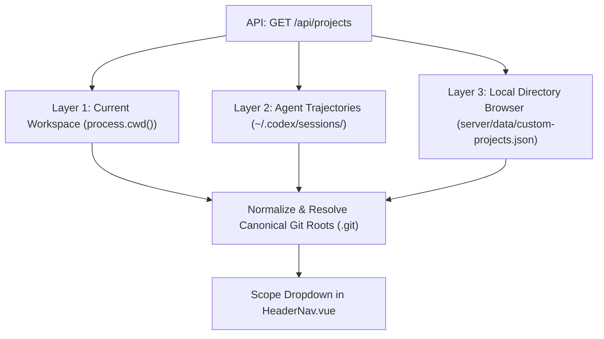

# 📁 Project Discovery & Data Privacy

The **Agent Token Tracker** is designed as a **100% local, privacy-preserving tool**. It never transmits your source code, conversation transcripts, token telemetry, or prompt texts to external servers.

---

## 1. The Three Project Discovery Layers



### Layer 1: Active Runtime Workspace
- Reads `process.cwd()` (the directory where the tracker was started).
- Automatically sets it as the default project with zero configuration required.

### Layer 2: Auto-Discovery from Agent Trajectories
- Scans `~/.codex/sessions/` and `~/.gemini/antigravity/brain/`.
- Extracts `session.meta.cwd` from conversation metadata.
- Traverses upward to detect the canonical repository root (containing `.git`).
- Automatically correlates past sessions with their respective codebases and aggregates session counts (e.g. `📁 my-app (24 sessions)`).

### Layer 3: Interactive Local Directory Explorer (`📁+`)
- Enables developers to navigate their local computer filesystem right from the UI.
- Inspects target directories for ecosystem tags (`Node.js`, `Git`, `AGENTS.md`, `Python`, `Rust`, `Go`).
- Persists user-selected projects locally in `server/data/custom-projects.json`.

---

## 2. Privacy Safeguards & Data Sensitivity

### A. Zero Telemetry Egress
All metric calculation, turn inspection, prompt linting, and benchmark execution take place in local Node.js process memory. No data is sent over the Internet.

### B. Git Ignore Safeguards
The repository configuration strictly prevents accidental leakage of user data, file backups, or private project diagnostics:

```gitignore
# User Data & Backups (Data Sensitivity)
.backups/
server/data/
docs/tokens-consumptions/issues/*.md
!docs/tokens-consumptions/issues/.gitkeep
*.jsonl
*.log
.env*
```

| Ignored Path | Purpose |
| :--- | :--- |
| **`server/data/`** | Contains custom user-added projects and local tracker settings. Kept out of version control. |
| **`.backups/`** | Atomic snapshots created prior to automated `AGENTS.md` or `package.json` file modifications. |
| **`docs/tokens-consumptions/issues/*.md`** | Generated issue post-mortems for private repositories. |
| **`*.jsonl`, `*.log`** | Raw agent interaction logs and trajectory dumps. |

---

## 3. Dynamic Environment-Aware Path Resolution

The codebase contains zero hardcoded absolute filesystem paths. All paths are resolved dynamically at runtime:
- Server roots resolve relative to `process.cwd()` or `import.meta.url`.
- User home folders resolve via `os.homedir()`.
- Backup directories resolve to `path.resolve('.backups')`.
