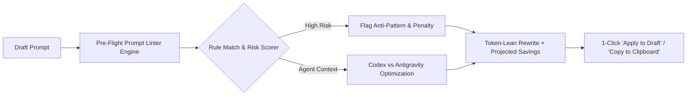

# 🔍 Pre-Flight Prompt Token Linter: Foundations & Specification

This document details the architectural foundations, economic principles, empirical telemetry baselines, and rule specifications governing the **Pre-Flight Prompt Token Linter** ([`server/promptLinterEngine.js`](file:///home/ellol/apps/agent-token-tracker/server/promptLinterEngine.js)).

---

## 1. Executive Overview

The Prompt Linter serves as an interactive, pre-flight gatekeeper for autonomous agent workflows. Before a developer submits a prompt to **OpenAI Codex** or **Google Antigravity**, the linter statically analyzes the prompt text against 10 established token-expansion anti-patterns, computes a risk score (`LOW`, `MEDIUM`, `HIGH`), projects token cost savings, and produces a single-click token-lean rewrite.



---

## 2. The Three Architectural Foundations

The linter's diagnostic rules are grounded in three core pillars:

### Foundation 1: Modern LLM Token Economics & Billing Mechanics

Modern frontier models (OpenAI o3/o4/gpt-5, Google Gemini 2.5/3.x, Anthropic Claude 3.7) operate under distinct economic constraints:

| Economic Mechanism | The Underlying Reality | Why the Linter Enforces It |
| :--- | :--- | :--- |
| **Prompt Cache Economics** | Cached input tokens receive an **80% to 90% discount** compared to fresh uncached input. Caches hit only when prior context prefixes remain bit-for-bit identical. | Ingesting noisy console logs, dynamic file trees, or random stack traces pollutes context and invalidates the cache prefix, forcing subsequent turns to be re-billed at full price. |
| **Quadratic Context Cost** | Every turn in an agent session re-transmits all prior conversation history and tool outputs to the model. | Unbounded file dumps or noisy test runs permanently increase the baseline token cost for **every subsequent turn** in that thread. |
| **Reasoning Token Premiums** | Deliberation tokens (`Think` / reasoning output) are billed as **output tokens** (typically 3x to 5x the cost of input tokens) and burn rapidly through 5-hour rate limits. | Requesting high reasoning effort on routine chores (typos, formatting, renames) wastes thousands of billable output tokens with zero quality benefit. |
| **Sequential Output Latency** | Model generation is bound by autoregressive token generation speeds (~40–80 tokens/sec). Full-file rewrites waste minutes and risk stripping comments. | Enforces targeted surgical replacements (`replace_file_content` / diff patches) rather than asking the model to re-emit entire 1,000-line files. |

---

### Foundation 2: Empirical Telemetry & Real-World Transcript Evidence

Rather than theoretical heuristics, every linter rule corresponds directly to documented failure modes discovered in real developer session transcripts (`~/.codex/sessions/` and `~/.gemini/antigravity/brain/`):

1. **Multi-Iteration Tool Explosion**:
   * *Evidence*: In session `01a06710-4d28-70d0-8247-f04305a5389a`, Turn #2 consumed **460,000 tokens** across 7 iterative tool calls because the prompt bundled multiple disparate refactoring objectives into a single turn.
   * *Linter Remedy*: **Rule 8 (Multi-Task Sprawl)** identifies compound conjunctions (`and also`, `and then also`) and advises decomposing into single-objective turns.
2. **The Passing Test Assertion Flood**:
   * *Evidence*: Test commands executed without quiet flags dumped 500+ lines of passing assertion output and verbose progress spinners, injecting 25,000+ un-cached tokens into a single turn.
   * *Linter Remedy*: **Rule 4 (Noisy Test Output)** automatically injects `--bail 1 --silent` (or `"test:agent"`).
3. **Unscoped File & Directory Scans**:
   * *Evidence*: Commands like `tree` or prompts asking to "check all files" caused agents to crawl `node_modules`, lockfiles, and binary assets, inflating context by 30k+ tokens.
   * *Linter Remedy*: **Rule 1 (Broad File Exploration)** and **Rule 3 (Directory Tree Dump)** rewrite requests to target specific feature subdirectories.

---

### Foundation 3: Role-Based Agent Guidance in [`AGENTS.md`](file:///home/ellol/apps/agent-token-tracker/AGENTS.md)

The linter programmatically enforces the operational contracts defined in [`AGENTS.md`](file:///home/ellol/apps/agent-token-tracker/AGENTS.md):

* **🏛️ Architect / Planner**: Break work into discrete tasks (under 15 turns per thread); use `reasoning_effort: low` for routine chores; reserve `high` reasoning only for complex algorithmic challenges.
* **💻 Implementation / Coder**: Practice **Progressive Disclosure** — inspect only targeted code sections using line ranges (`StartLine`/`EndLine`); use surgical replacements over whole-file rewrites.
* **🧪 Testing & Verification**: Execute test runners with fail-fast and silent flags (`--bail 1 --silent`); suppress passing console noise.
* **🔍 Codebase Researcher**: Use targeted tools (`grep_search`, `find_by_name` with `MaxDepth`) before opening files.

---

## 3. The 10 Anti-Pattern Rules Specification

The linter evaluates draft prompts across 10 structured rules in [`server/promptLinterEngine.js`](file:///home/ellol/apps/agent-token-tracker/server/promptLinterEngine.js):

| # | Rule ID | Category | Severity | Penalty | Est. Waste | Trigger Patterns | Prescribed Lean Rewrite |
| :-: | :--- | :--- | :---: | :-: | :-: | :--- | :--- |
| **1** | `BROAD_FILE_SCAN` | Context Ingestion | **HIGH** | -30 | +35k tok | `all files`, `check all`, `search whole`, `every file` | Rewrites to scoped feature directory (e.g. `src/features/auth/`). |
| **2** | `FULL_FILE_READ` | Context Ingestion | **MEDIUM** | -20 | +15k tok | `read the whole file`, `show full file`, `read entirely` | Advises line ranges (`StartLine`/`EndLine`) or symbol lookup. |
| **3** | `FULL_DIRECTORY_DUMP` | Context Ingestion | **HIGH** | -25 | +20k tok | `tree`, `ls -R`, `find .`, `dir /s`, `directory tree` | Rewrites to shallow top-level exploration (`find . -maxdepth 2`). |
| **4** | `UNFILTERED_TEST_OUTPUT` | Execution Noise | **HIGH** | -30 | +25k tok | `npm test`, `pnpm test`, `jest`, `pytest` without flags | Injects `--bail 1 --silent` or `"test:agent"`. |
| **5** | `UNBOUNDED_GIT_LOG` | Execution Noise | **LOW** | -15 | +8k tok | `git log` without `-n` or `--oneline` | Injects `git log -n 5 --oneline`. |
| **6** | `HIGH_REASONING_ROUTINE` | Model Deliberation | **HIGH** | -30 | +18k tok | Routine chores (typo, rename, format) + "think deeply" | Enforces `reasoning_effort: low` for routine chores. |
| **7** | `FULL_FILE_REWRITE` | Output Bloat | **HIGH** | -25 | +22k tok | `rewrite whole file`, `rewrite from scratch` | Advises surgical diffs (`replace_file_content`) for affected blocks. |
| **8** | `MULTI_TASK_SPRAWL` | Lifecycle Breakdown | **HIGH** | -55 | +30k tok | Multiple tasks chained via `and also`, `and then also` | Flags high risk; advises single-objective turn decomposing. |
| **9** | `UNSCOPED_LINTER` | Execution Noise | **LOW** | -15 | +6k tok | `eslint .`, `tsc`, `npm run lint` without quiet flags | Appends `--quiet` and path scoping. |
| **10** | `AGENT_OPTIMIZATION` | Agent Paradigms | **LOW** | -5 | +2k tok | Long-running tasks without slash commands or diff advice | Antigravity: `/goal` slash command; Codex: concise diffs. |

---

## 4. Agent-Specific Intelligence Targeting

The prompt linter provides platform-specific advice via an interactive toggle:

### ⚡ OpenAI Codex Mode
* **Non-Interactive Tooling**: Advises non-interactive CLI flags (`--bail 1 --silent`, `git log -n 5 --oneline`).
* **Atomic Patching**: Encourages the use of `apply_patch` constraints rather than rewriting full source files.
* **Concise Explanations**: Suggests appending *"keep explanations concise and prioritize code diffs"* to minimize expensive billable output tokens.

### 🌌 Google Antigravity Mode
* **Native Slash Commands**: For long-running or autonomous tasks, recommends prefixing prompts with `/goal` (for exhaustive overnight execution) or `/grill-me` (for interactive alignment interviews).
* **Progressive Disclosure**: Emphasizes `view_file` parameter slicing (`StartLine`/`EndLine`) to prevent prompt context bloat.
* **Workflow Skills**: Recommends encapsulating repetitive multi-turn test/lint procedures into `.agents/skills/<name>/SKILL.md`.

---

## 5. Architectural Implementation Across the Stack

```
server/
  ├── promptLinterEngine.js          # Core static analysis, rule regexes, score & token projector
  └── index.js                       # POST /api/lint-prompt endpoint
src/
  ├── composables/
  │   └── usePromptLinter.js         # Debounced reactive evaluation (250ms), agent state management
  └── components/
      └── ActionPromptLinterModal.vue# Vue 3 modal, agent switcher, copy feedback, rule chips, counter
tests/
  └── promptLinterEngine.test.js     # Native Node.js test suite verifying all 10 rules (11 tests)
```

---

## 6. Verification & Automated Testing

The prompt linter engine is verified via native Node.js unit tests (`node:test`):

```bash
node --test tests/promptLinterEngine.test.js
```

All 11 unit tests pass, verifying:
- Clean/empty prompt baseline preservation (Score: 100, `LOW` risk).
- Accurate penalty scoring and warning categorization across all 10 rules.
- Proper rewrite transformations (e.g. injecting `--bail 1 --silent`, `/goal`, `git log -n 5 --oneline`).
- Accurate platform behavior across Codex and Antigravity modes.
